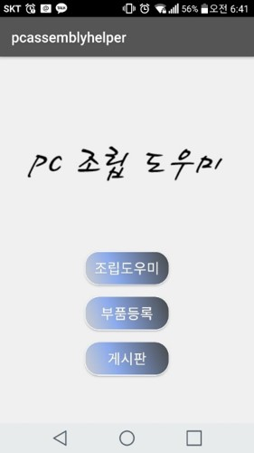
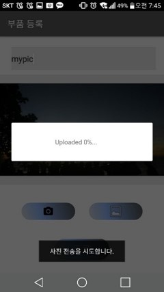
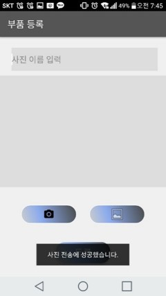
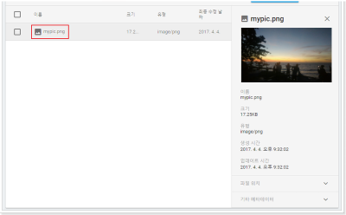

# 모바일 프로젝트 (PC 조립 도우미)

핸드폰 카메라와 AR 기능을 사용하여 컴퓨터 조립을 돕는 애플리케이션 개발

## 개요

+ 제작 인원 : 3명
+ 개발 기간 : 약 3개월 (2017.09~2017.12)
+ 사용 언어 : Kotlin

## 사용 기술

+ Android Studio 3.0(안드로이드 스튜디오)
+ Vuforia(뷰포리아) - AR 개발 소프트웨어
+ Firebase(Google Cloud Storage) - 사진 업로드 DB

## 나의 작업

+ 커스텀 카메라 구현
+ Firebase에 사진을 업로드하는 기능 구현
+ Firebase에 업로드된 사진을 게시판에서 다운로드하는 기능 구현

동영상 링크
+ https://youtu.be/HgN0myEfXes

## 미리보기 사진

### 메인화면

### 부품 등록 화면
   

### Firebase에 업로드 된 사진

